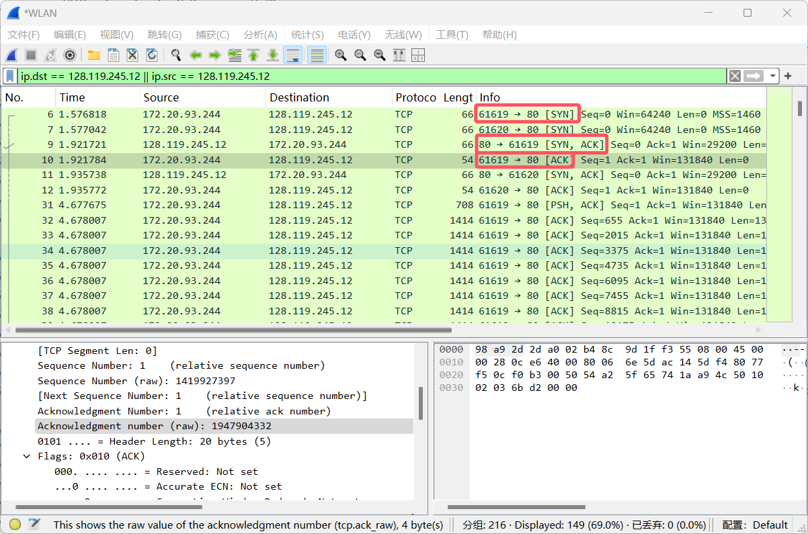

## Wireshark 的使用

打开 Wireshark，捕获无线网（WLAN）里的请求。

尝试使用浏览器访问 http://www.hit.edu.cn，在 Wireshark 里筛选 HTTP 协议的捕获，可在捕获列表里查询到访问 www.hit.edu.cn 的 GET 请求。结果如上图所示。

## 利用 Wireshark 分析 HTTP 协议

### HTTP GET/response 交互

在浏览器里键入地址 http://today.hit.edu.cn，同时使用 Wireshark 捕获 HTTP 协议。结果如上图所示。

观察上述浏览器发送的 HTTP 请求以及服务器做出的响应，可在捕获结果中发现：

- 浏览器发送地址是 172.20.93.244，发送使用的 HTTP 协议版本号为 1.1；
- 服务器返回地址是 202.118.254.117，发送使用的 HTTP 协议版本号为 1.1，返回的状态码为 200 OK。

此外还可以在浏览器请求信息里看到接受的语言信息为中文（大陆）、中文（台湾）、中文（香港）、英文、日文。

总结：

1. 浏览器运行的 **HTTP 协议版本号为 1.1**，服务器返回的 **HTTP 协议版本号为 1.1**；
2. 浏览器向服务器指出可以接受**中文（大陆）、中文（台湾）、中文（香港）、英文、日文**的对象；
3. 计算机的 IP 地址为 **172.20.93.244**，服务器的 IP 地址为 **202.118.254.117**；
4. 从服务器返回的状态码为 **200**。

### HTTP 条件 GET/response 交互

- 在第一次访问中，浏览器发送的信息里**不带有 If-Modified-Since 头部**，返回的状态码为 200 且**包含完整的网页信息**；
- 在第二次访问中，浏览器发送的请求**带上了头部 If-Modified-Since**: Wed, 30 Oct 2024 06:03:24 GMT，后面携带的是当前**本地缓存的时间**，表示询问服务器是否在国际标准时间 2024 年 10 月 30 号 6 点 3 分 24 秒星期三之后发生了修改。服务器返回响应的**状态码为 304 Not Modified**，告知浏览器网页内容未发生改变，且**服务器未返回网页信息**，由浏览器直接调用缓存。

## 利用 Wireshark 分析 TCP 协议

### A. 俘获大量的由本地主机到远程服务器的 TCP 分组

向该网站传输 alice.txt，捕获到的 TCP 协议如图所示。

### B. 浏览追踪信息

从中可以得到向 gaia.cs.umass.edu 传输数据的**客户端 IP 为 172.20.93.244**，可在 Info 当中看到客户端**发送端口为 61619**，服务器接收端口为 80。而 gaia.cs.umass.edu **服务器的 IP 地址为 128.119.245.12**，它用于**发送和接收 TCP 报文所用的端口为 80**。

### C. TCP 基础

从客户端发送出的 SYN 报文段**序号为 1419927396**。在该报文段里**通过标记位 SYN 设置为 1** 来表示这是一个 SYN 报文段。

从服务端发送出的 SYNACK 报文段**序号为 1947904331**，该报文段中 **ACK 值为 1419927397**，通过**计算为客户端发送的 SYN 报文段的序号值加一**决定该值。在该报文段里，**通过标记位 SYN 和 ACK 均设置为 1** 来表示这是一个 SYNACK 报文段。

在图中可以看出 TCP 协议**三次握手**的过程。这三次报文传输的长度都很短，且不包含具体传输内容，只设置了状态位以及 SYN ACK 之类参数。

在图中可以看出**携带 POST 命令**的 TCP 报文，序号为 **1419927397**，刚好为**客户端 SYN 报文序号加一**。

在图中可以看出**第六个 TCP 报文的序列值为 1419933491**，相对值为 6095。该报文是在进行三次握手之后发送的第六个 TCP 报文，即整个过程当中第九个 TCP 报文。而该报文的对应的 ACK 序号则是在**第三次握手的时候接收的**。

图中可以看出**前六个报文段的长度**分别为 **654，1360，1360，1360，1360，1360**。

整个追踪过程中接收方公示的**最小缓冲长度为 29200**，而在绝大多数应答中缓冲长度在不断增加，只有少量波动。说明接收方的缓冲长度**始终够用**。

在整个追踪过程中，发现接收方获取到的数据序号保持单调增长，说明**没有发生数据重传**。

在图片里可以看出 TCP 连接开始建立的时间戳为 1.5761818 秒，而在服务端返回所有 ACK 报文并结束 TCP 通信时的时间戳为 6.548545 秒。整个过程中传输的数据总量为 152975 字节，因此可以得到**平均传输速度为 30765 字节每秒**。

## 利用 Wireshark 分析 I P 协议

### 问题 1

主机的 **IP 地址是 172.20.244.72**，**上层协议为 IMCP**。同时可以看出 **IP 头共有 20 字节**，总长度为 1520 字节，于是**载荷大小为 1500 字节**。

由于发送的总 ping 数据包长度为 2000，因此**分成了两片**。可以通过判断标志位来确定是否允许分片、后续是否有分片内容、当前帧的偏移量是多少。

### 问题 2

**标识 ID、生存时间（TTL）、首部校验和、数据域总在变化**，除了以上四个数据外其余的数据必须保持常量。原因是标识 ID 唯一，所以每个数据报有所区别， 随之首部校验和也不断改变；TTL 在不断变大因为是 ICMP 的 ping 探测而且数据域中封装有 ICMP 的报文，因为 ICMP 的头部信息也在变化，所以 IP 数据报的数据域也随之变化。

IP 数据报的 Identification 字段值的形式是：**每一个报文一个唯一的 16 位的数值，且在线性递增，不断增加 1**。

### 问题 3

**Identification 字段值为 0，TTL 字段是 254**。这些值中 **Identification 值会改变**，而 **TTL 字段不变**，原因是 Identification 字段是唯一标识一个 IP 报文的字段，而 TTL 的值则是最近路由器设置好的值。

### 问题 4

该消息被分解成为 **2 个数据报**。第一个分片中**标志位的 MF** 被置为 1 说明后面还有分片。**该分片的数据域长度为 1480B，IP 总长度为 1500B**。

### 问题 5

**分为了 3 片**。头部中**标志位 MF 变化、片偏移发生变化**。第一个和第二个分片标志位 MF 为 1 表示后面还有分片，第一个分片的片偏移为 0 第二个为 185 第三个为 370。

## 利用 Wireshark 分析 DNS 协议

在浏览器内键入 https://www.baidu.com，同时使用 Wireshark 捕获 DNS 结果如下：

分析如下：

- 浏览器向 DNS 服务器 8.8.8.8 发送了 DNS 查询，是一个 A 类查询，询问 URL www.baidu.com 的 IP 地址。
- DNS 服务器 8.8.8.8 向浏览器返回的 DNS 查询结果包含三条，分别如下：
  - 第一个结果是一条 CNAME 类回答，说明 www.baidu.com 是一个别名，对应的真实网址为 www.a.shifen.com；
  - 第二个结果是一条 A 类回答，说明 www.a.shifen.com 域名对应一条 IP 地址为 39.156.66.14；
  - 第三个结果是一条 A 类回答，说明 www.a.shifen.com 域名对应一条 IP 地址为 39.156.66.18。

此次查询结果说明 www.baidu.com 映射到网址 www.a.shifen.com，而该网址下又有两个 IP 地址 39.156.66.14 和 39.156.66.18。浏览器可以访问这两个 IP 地址之一来从百度获取资源。

## 利用 Wireshark 分析 UDP 协议

### 问题 1

如图，消息是**基于 UDP 的**。

### 问题 2

从图中可以看出，**本机 IP 地址为 172.20.29.25**，**目的主机 IP 是 111.161.107.159**。

### 问题 3

从图中可以看出，主机的**发送端口是 4000**，**服务器端口号为 8000**。

### 问题 4

数据包的头部包含发送**端口号** 2B、目的**端口号** 2B、**UDP 长度** 2B、**UDP 校验和** 2B。

### 问题 5

由于 UDP 是不可靠的数据传输，客户端并不知道服务端是否接受到信号，因此需要服务端向客户端再发送一个 ICQ 报文表示应答。UDP 没有握手建立连接的过程，也没有挥手结束连接的过程，是无连接的。

## 利用 Wireshark 分析 ARP 协议

### 问题 1

使用 arp 指令查看当前计算机上缓存的 ARP 数据如下：

其中，第一列是 **IP 地址**，第二列是 **MAC 地址**，第三列是**类型**，即是静态类型还是动态类型。

### 问题 2

ARP 请求/应答报文的结构如下：

由 9 个部分组成。分别是**硬件类型** 2B、**协议类型** 2B、**硬件地址长度** 1B、**协议地址长度** 1B、**操作码** 2B、**发送端 MAC 地址** 6B、**发送端 IP 地址** 4B、**目的端 MAC 地址** 6B、**目的端 IP 地址** 4B。

### 问题 3

通过 OP 字段判断。如果 OP 为 1 则是请求包，如果 OP 为 2 则是应答包。

### 问题 4

- 查询 ARP 不知道目的 IP 对应的 MAC 地址，因此需要广播查询，即设置目的端 MAC 地址为 `FF:FF:FF:FF:FF:FF`。
- 应答 ARP 由于已经通过查询 ARP 知道了查询方的 MAC 地址，因此可以直接响应一个目的地址。
